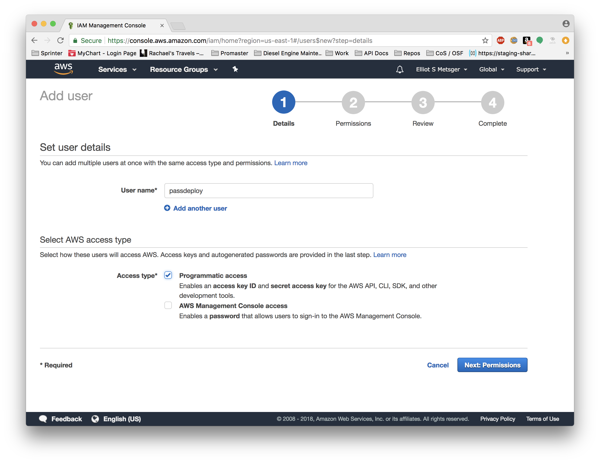
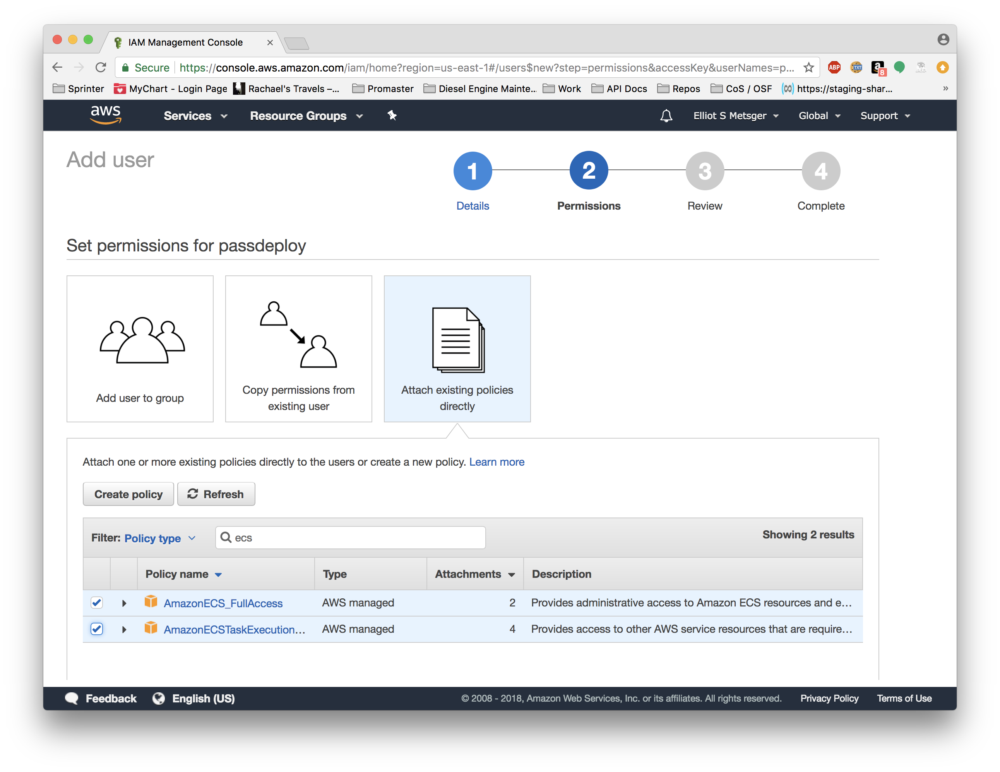
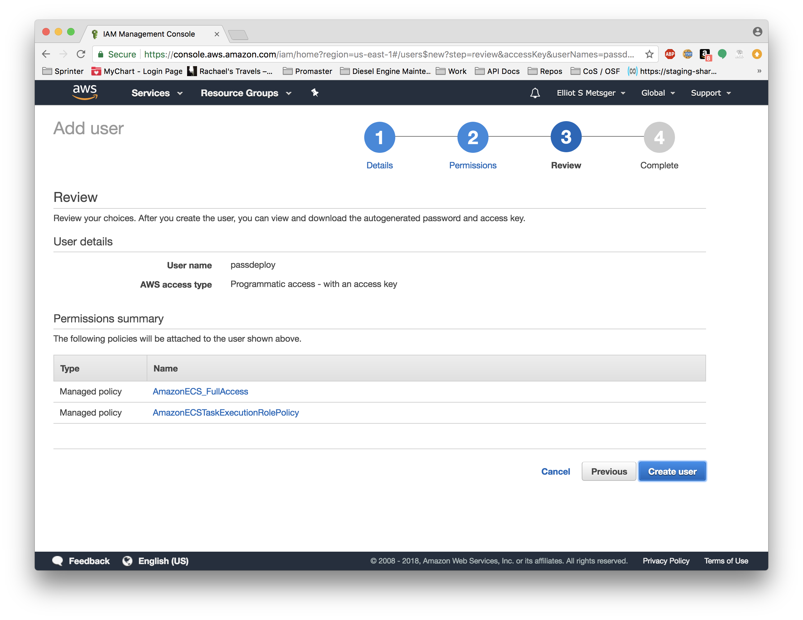
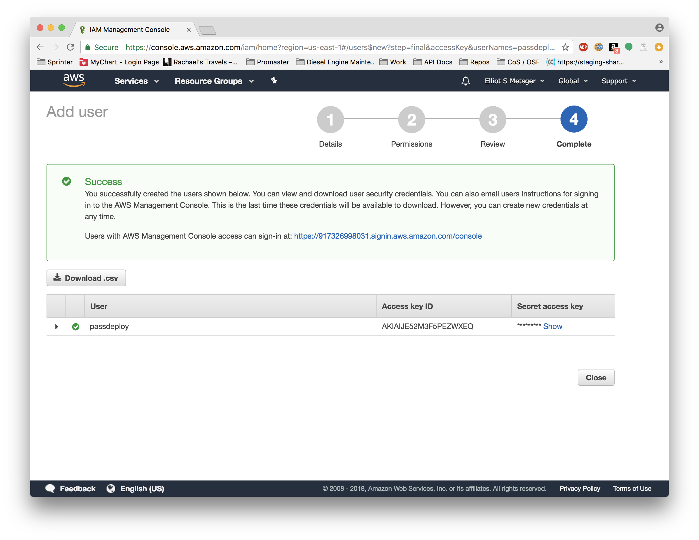

This document includes instructions for properly configuring users and roles using the Amazon Identity and Access Management (IAM) tool.

These instructions include creating and retrieving an `AWS_ACCESS_KEY_ID` and `AWS_SECRET_ACCESS_KEY`, and enabling the proper policies for managing ECS resources using the `ecs-cli`.

<h2><a id="create_user" href="#create_user">Creating a User for ECS</a></h2>

1. Login to the AWS console and navigate to the IAM "Users" service, and select the button to add a user.  Supply a username, and check the _Programmatic access_ box.

2. Apply the proper permissions directly to the user, by selecting _Attach existing policies directly_, and selecting all the policies that match the search string _ecs_.

3. Review your choices and click _Create User_

4. Retrieve your Access Key ID and Secret Access Key.  These values can be set in the `AWS_ACCESS_KEY_ID` and `AWS_SECRET_ACCESS_KEY` environment variables, and be used when [configuring your authentication profile](AMAZON.md#ecs_cli_config) for the ECS CLI.

<h2><a id="create_user" href="#create_user">Creating an ECS Task Execution Role</a></h2>

